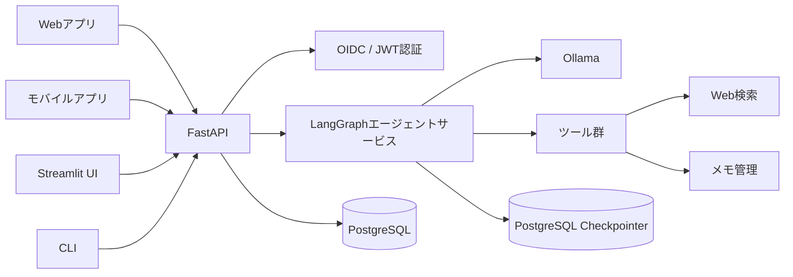

# Web・モバイル向けAPI実装計画

## 実装状況

| フェーズ | 状況 | ブランチ |
|---|---|---|
| フェーズ1：エージェント共通コアの分離 | 実装済み | `feature/phase1-agent-core` |
| フェーズ2：FastAPIの最小API | `develop`へマージ済み | `feature/phase2-fastapi-api` |
| フェーズ3：PostgreSQLと会話管理 | `develop`へマージ済み | `feature/phase3-postgresql-conversations` |
| フェーズ4-A：OIDC/JWT認証と所有者分離 | `develop`へマージ済み | `feature/phase4a-oidc-auth` |
| フェーズ4-B：API保護の強化 | `develop`へマージ済み | `feature/phase4b-api-protection` |
| フェーズ5：StreamlitのAPIクライアント化 | `develop`へマージ済み | `feature/phase5-streamlit-api-client` |
| フェーズ6以降 | 未着手 | - |

フェーズ1では`AgentService`、同期・非同期対応グラフ、実行タイムアウト、ツール呼び出し上限、安全なエラー分類、Ollama接続・モデル一覧取得、CLI・Streamlit接続、および関連テストを追加した。

フェーズ2ではFastAPIアプリ、JSON API、SSEによるトークン・ツールイベント配信、OpenAPI、リクエストID、冪等性キー、同一会話の同時実行防止、切断・キャンセル処理、およびAPIテストを追加した。会話ID、実行ロック、冪等性キャッシュはフェーズ3までプロセス内管理とする。

フェーズ3ではPostgreSQL用LangGraphチェックポインタ、SQLAlchemyモデル、Alembic、会話・メモ管理API、実行履歴・冪等性の永続化、複数プロセス間の実行リース、キャンセル要求、保存期限クリーンアップ、SQLite移行ツールを追加した。認証導入前の所有者は固定のローカルユーザーとし、フェーズ4でOIDC/JWTの利用者へ置き換える。

フェーズ4は利用上限を抑えつつ安全に検証できるよう、4-Aと4-Bへ分割した。4-AではKeycloak、OIDC Discovery/JWKS、RS256 JWT検証、`sub`と内部ユーザーの対応付け、会話・メモ・エージェントツールの所有者分離を実装する。4-BではCORS、ユーザー/IP単位のレート制限、構造化ログと機密情報マスキング、副作用ツールを無承認で登録させない承認ポリシー基盤を実装する。

## 1. 目的

現在のLangGraph + Ollamaエージェントを、Streamlit Web UIだけでなく、Webアプリおよびモバイルアプリから共通API経由で安全に利用できる構成へ拡張する。

本計画では以下を実現する。

- LangGraphエージェントをUIから分離し、共通サービスとして利用する
- Web・モバイル共通のHTTPS APIを提供する
- 回答およびツール実行状況をストリーミング配信する
- ユーザーごとに会話、メモ、実行履歴を分離する
- 複数ユーザーの同時利用、障害対応、監視、データ保持に対応する
- 既存のStreamlit UIを共通APIのクライアントへ移行する

## 2. 推奨アーキテクチャ



### 推奨技術

| 項目 | 推奨方式 |
|---|---|
| API | FastAPI |
| ストリーミング | Server-Sent Events（SSE） |
| 認証 | OIDC / JWT |
| 本番データベース | PostgreSQL |
| 開発用データベース | SQLiteまたはPostgreSQL |
| DBマイグレーション | Alembic |
| API仕様 | OpenAPI |
| LLM | Ollama（APIサーバーからのみ接続） |
| ログ | JSON形式の構造化ログ |

## 3. 基本方針

1. クライアントからOllamaやデータベースへ直接接続しない。
2. UUIDやスレッドIDを認可手段として扱わない。
3. LangGraph実装はUI、HTTP、データベースの詳細から分離する。
4. 会話・メモ・ツール実行履歴は必ずユーザー所有権を確認する。
5. 外部アクセス、モデル呼び出し、ツール呼び出しにはタイムアウトと上限を設ける。
6. 開発環境と本番環境で同じAPI契約を使用する。
7. READMEおよび関連ドキュメントを各フェーズで更新する。

## 4. 実装フェーズ

### フェーズ1：エージェント共通コアの分離（実装済み）

#### 実装内容

- `src/agent.py`からCLI・Streamlit固有処理を分離する
- `invoke()`および`stream()`中心の処理を、`ainvoke()`および`astream()`中心へ変更する
- モデル、チェックポインタ、ツール、設定を依存性注入できる構造にする
- エージェント実行を統括する`AgentService`を追加する
- モデル実行時間、ツール回数、再帰回数に上限を設ける
- Ollama接続確認と利用可能モデル取得処理を追加する
- 内部例外と利用者向けエラーを分離する

#### 完了条件

- UIを起動せずにエージェントを非同期実行できる
- モックLLMを利用したストリーミングテストが成功する
- Ollama停止時に設定された時間内でエラーが返る
- CLIと既存テストが継続して動作する

### フェーズ2：FastAPIの最小API（実装済み）

#### 初期API

```text
GET  /health
GET  /ready
GET  /v1/models
POST /v1/conversations
POST /v1/conversations/{conversation_id}/messages
POST /v1/conversations/{conversation_id}/messages/stream
```

#### 実装内容

- FastAPIアプリケーションを追加する
- Pydanticでリクエスト・レスポンスを定義する
- OpenAPI仕様を生成する
- SSEで回答とツールイベントを配信する
- リクエストIDを発行する
- クライアント切断時の処理中断を実装する
- 同一メッセージの二重送信を防ぐ冪等性キーに対応する
- 同一会話への同時送信を制御する

#### SSEイベント

```text
message.started
assistant.delta
tool.started
tool.completed
message.completed
message.failed
```

#### 完了条件

- HTTPクライアントから会話を開始できる
- 回答を逐次受信できる
- ツール実行開始・完了をイベントとして受信できる
- 切断やキャンセル後も会話状態が破損しない

### フェーズ3：PostgreSQLと会話管理（実装済み）

#### データモデル

| テーブル | 主な用途 |
|---|---|
| `users` | 利用者識別 |
| `conversations` | 会話タイトル、所有者、状態、作成日時 |
| `notes` | ユーザー・会話単位のメモ |
| `tool_executions` | ツール実行結果、時間、成否 |
| `usage_records` | モデル、処理時間、利用量 |
| LangGraph用テーブル | チェックポイントおよび書き込み履歴 |

#### 会話管理API

```text
GET    /v1/conversations
GET    /v1/conversations/{conversation_id}
PATCH  /v1/conversations/{conversation_id}
DELETE /v1/conversations/{conversation_id}
GET    /v1/conversations/{conversation_id}/messages
POST   /v1/conversations/{conversation_id}/cancel
```

#### メモ管理API

```text
GET    /v1/conversations/{conversation_id}/notes
POST   /v1/conversations/{conversation_id}/notes
PATCH  /v1/conversations/{conversation_id}/notes/{note_id}
DELETE /v1/conversations/{conversation_id}/notes/{note_id}
```

#### 実装内容

- PostgreSQL用LangGraphチェックポインタへ移行する
- Alembicマイグレーションを導入する
- 会話とユーザーを紐付ける
- 会話一覧、名前変更、再開、削除を実装する
- 会話削除時にチェックポイントと関連メモを削除する
- 保存期限と定期削除の基盤を追加する
- SQLiteからPostgreSQLへの移行手順を用意する

#### 完了条件

- APIサーバー再起動後も履歴を復元できる
- 会話削除後に関連する会話履歴とメモが残らない
- 複数APIプロセスから同じデータを安全に利用できる

### フェーズ4-A：OIDC/JWT認証と所有者分離（実装済み）

#### 実装内容

- Dockge向けKeycloak + PostgreSQL Composeを追加する
- WEB用`langgraph-web`とモバイル用`langgraph-mobile`を公開クライアントとして作成し、Authorization Code + PKCE（S256）を使用する
- `langgraph-api`をResource Serverとして定義し、アクセストークンへAPI audienceを付与する
- OIDC DiscoveryからJWKS URLを取得し、署名鍵を期限付きキャッシュする
- JWTのRS256署名、`iss`、`aud`、`exp`、`iat`、`sub`を検証する
- JWTの`sub`を`users.external_subject`へ対応付け、安定した内部UUIDを割り当てる
- 全`/v1/*` API、会話、メモ、LangGraphメモツールでユーザー所有権を適用する
- `/health`と`/ready`は監視用として認証不要のまま維持する
- ローカルCLI・既存Streamlitの直接利用は変更せず残す

#### 完了条件

- トークンなし、署名不正、発行者不一致、audience不一致、期限切れトークンを拒否する
- 他ユーザーの会話IDを指定しても内容を取得できない
- WEB・モバイル用アクセストークンの`aud`に`langgraph-api`が含まれる
- Keycloak、PostgreSQL、Ollamaを用いた実環境テストが成功する

### フェーズ4-B：API保護の強化（実装済み）

#### 実装内容

- CORSの許可元を環境別に限定する
- ユーザー単位・IP単位のレート制限を追加する
- 入力文字数、検索件数、ツール回数を検証する。添付ファイルAPIを追加する際は受信前のサイズ上限を必須とする
- 内部URL、例外、スタックトレースを利用者へ返さない
- ログ内の個人情報、トークン、ツール引数をマスキングする
- 将来の副作用ツールに備えて承認フローを設計する

#### 実装方式

- `CORS_ALLOWED_ORIGINS`に列挙した完全一致Originのみを許可し、`*`は起動時に拒否する
- CORSプリフライトはレートカウントから除外する
- 認証前にIP単位、認証後にユーザー単位の固定窓レート制限を適用する
- PostgreSQLの`rate_limit_buckets`で複数APIプロセスのカウンターを共有し、IP・ユーザーIDはSHA-256値だけを保存する
- 超過時は`429 rate_limit_exceeded`と`RateLimit`、`RateLimit-Policy`、`Retry-After`ヘッダーを返す。移行期間の互換性のため従来の`RateLimit-*`ヘッダーも返す
- JSONアクセスログには本文、Authorization、Cookie、トークン、ツール引数を含めず、IP・ユーザーIDは短縮ハッシュで記録する
- メッセージは最大20,000文字、検索語は最大500文字、検索結果は最大10件、ツール呼び出しは設定値までに制限する。現行APIは添付ファイルを受け付けない
- `APPROVAL_REQUIRED_TOOLS`に列挙された外部副作用ツールは、承認実行器が接続されるまでグラフ登録時に拒否する
- 現在の`web_search`、`calculator`、`get_current_datetime`は読み取り専用、`save_note`は内部書き込みとして継続利用する

#### 完了条件

- 無効または期限切れのトークンが拒否される
- 他ユーザーの会話IDを指定しても内容を取得できない
- レスポンスに内部例外や接続情報が含まれない
- 設定されたレートを超えたアクセスが制限される

### フェーズ5：StreamlitのAPIクライアント化（実装・動作確認済み）

#### 実装内容

- StreamlitからLangGraphとSQLiteへの直接アクセスを削除する
- 共通API経由で会話作成、履歴取得、送信、削除を行う
- SSEを利用して回答を逐次表示する
- 会話一覧、会話名変更、再開、削除を追加する
- 回答停止ボタンを追加する
- API、Ollama、データベースの稼働状態を表示する
- 認証状態を表示する
- ツール実行ログから機密情報を除外する

#### 実装方式

- `src/web_api_client.py`にFastAPIのJSON・SSE契約を扱う同期クライアントを分離する
- StreamlitはLangGraph、SQLite、PostgreSQL、Ollamaへ直接接続しない
- KeycloakにStreamlit専用の機密クライアントを用意し、`st.login()`でAuthorization Codeフローを開始する
- アクセストークンは`st.user.tokens`からサーバー側で取得し、画面・ログ・URLへ出さずBearer認証にだけ使用する
- 会話IDはURLの`conversation`クエリへ保存し、画面再読み込み時はAPIから会話と履歴を復元する
- SSEの`assistant.delta`を逐次描画し、ツールイベントはツール名と開始・完了状態だけを表示する
- フォーム内の`st.text_area`と明示送信ボタンを使用し、IME確定のEnterでは送信しない。Ctrl／Command+Enterでも送信できる
- 生成中は専用停止ボタンを表示し、SSEハートビートでStreamlitの中断点を確保してキャンセルAPIも呼び出す
- API、Ollama、PostgreSQLの状態は`/ready`から表示する
- 会話作成、一覧、名前変更、アーカイブ・再開、削除、メモ参照を共通API経由で行う

#### 完了条件

- StreamlitがLangGraphやデータベースへ直接接続しない
- ブラウザ再読み込み後もAPIから履歴を復元できる
- Webアプリと同じAPI契約で動作する

#### 動作確認結果

- KeycloakのAuthorization Codeフローでログインできる
- `langgraph-api` audienceを含むアクセストークンで会話一覧・作成・履歴取得が成功する
- SSEでエージェント回答を逐次受信し、回答後にAPIから保存済み履歴を復元できる
- API、Ollama、PostgreSQLの稼働状態をStreamlitで確認できる
- 全71件の自動テストが成功する

### フェーズ6：モバイル・Webクライアント向け仕様確定

#### 実装内容

- OpenAPI仕様を確定する
- 認証トークン取得・更新・失効手順を文書化する
- SSE再接続と途中切断時の動作を定義する
- モバイルのバックグラウンド移行時の扱いを定義する
- 冪等性キーとリトライ方法を定義する
- API互換性維持方針を定義する
- 必要に応じてTypeScript、Kotlin、Swift用クライアントを生成する

#### 完了条件

- Web・iOS・Androidの各クライアントが同じAPIを利用できる
- 通信切断時に重複メッセージを作らず再試行できる
- API仕様からクライアントコードを生成できる

### フェーズ7：監視・運用・デプロイ

#### 実装内容

- JSON形式の構造化ログを追加する
- 応答時間、失敗率、同時実行数、ツール実行時間を計測する
- Ollama障害時のサーキットブレーカーを追加する
- 同時実行数制限と待機キューを追加する
- `/health`と`/ready`でAPI、DB、Ollamaの状態を分離して返す
- Dockerイメージを作成する
- 開発、検証、本番の設定を分離する
- PostgreSQLのバックアップ・復旧手順を作成する
- 会話データの保存期限と定期削除ジョブを実装する

#### 完了条件

- 障害原因をリクエストIDから追跡できる
- Ollama障害時にAPI全体が停止しない
- バックアップから会話データを復元できる
- 本番環境で複数APIプロセスを起動できる

## 5. テスト計画

### 単体テスト

- エージェント状態遷移
- ツール回数・時間制限
- 入力検証
- 所有者判定
- エラー変換
- SSEイベント変換

### 統合テスト

- PostgreSQLチェックポイント保存・復元
- 会話作成・一覧・更新・削除
- メモのCRUD
- JWT検証
- Ollama停止・タイムアウト
- Web検索失敗・検索件数上限
- 同一会話への同時送信

### E2Eテスト

- StreamlitからAPIを経由した会話
- 認証から会話削除までの一連の操作
- SSE切断・再接続
- APIサーバー再起動後の履歴復元
- 別ユーザーによるアクセス拒否

### 負荷テスト

- 同時接続数別の応答時間
- Ollamaのモデル別同時処理能力
- 待機キュー上限到達時の動作
- PostgreSQL接続プールの使用状況
- 長期会話のチェックポイント増加量

## 6. 推奨ディレクトリ構成

```text
src/
├── api/
│   ├── app.py
│   ├── dependencies.py
│   ├── errors.py
│   └── routes/
├── core/
│   ├── agent.py
│   ├── models.py
│   └── tool_policy.py
├── services/
│   ├── agent_service.py
│   ├── conversation_service.py
│   └── model_service.py
├── repositories/
│   ├── conversations.py
│   └── notes.py
├── db/
│   ├── models.py
│   ├── session.py
│   └── migrations/
├── tools/
├── clients/
│   └── agent_api.py
├── web_app.py
├── cli.py
└── config.py
```

## 7. 実装順序とマイルストーン

### マイルストーン1：ローカルAPI

1. エージェント共通コアの分離
2. FastAPIの追加
3. SSEストリーミング
4. タイムアウトとキャンセル
5. APIテスト

成果物：認証なしでローカル利用できるAPI。

### マイルストーン2：認証付き永続API

1. PostgreSQL導入
2. 会話・メモ管理
3. OIDC / JWT認証
4. 所有者チェック
5. レート制限
6. StreamlitのAPIクライアント化

成果物：複数ユーザーが安全に利用できる検証環境。

### マイルストーン3：本番運用

1. 監視と構造化ログ
2. バックアップと保存期限
3. 同時実行制御と待機キュー
4. 負荷テスト
5. Web・モバイル向けAPI仕様確定
6. 本番デプロイ手順作成

成果物：Web・モバイルアプリから利用できる本番API。

## 8. 実装前に確定する事項

以下はマイルストーン2の開始前までに決定する。

1. 認証サービス：Auth0、Clerk、Cognito、Keycloakなど
2. APIおよびOllamaのデプロイ先
3. 想定ユーザー数と同時利用者数
4. 会話・メモの保存期間
5. 1ユーザーあたりの利用上限
6. Ollamaのみを使うか、クラウドLLMも選択可能にするか
7. 個人情報・機密情報を扱うか
8. モバイルの対象：iOS、Android、または両方

## 9. ドキュメント更新対象

各フェーズの完了時に以下を更新する。

- プロジェクトの`README.md`
- 本ドキュメントディレクトリの`README.md`
- `architecture.md`
- `usage_guide.md`
- `customization.md`
- OpenAPI仕様およびAPI利用例
- 認証・セキュリティガイド
- デプロイ・バックアップ・障害対応手順

## 10. 最初に着手する作業

最初の実装単位は、既存機能を維持しながら以下を行う。

1. `src/agent.py`の非同期対応と共通サービス化
2. FastAPIの`/health`、会話作成、メッセージ送信API追加
3. SSEによる回答ストリーミング
4. Ollamaタイムアウトと利用者向けエラー処理
5. API単体テストとREADME更新

この段階ではSQLiteを継続利用し、API契約とエージェント分離が安定した後にPostgreSQLと認証を導入する。
