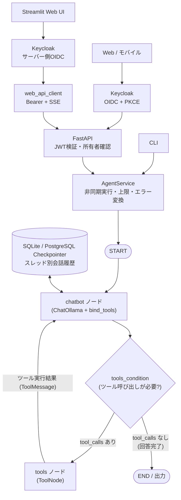

# アーキテクチャ & 設計詳細

本ドキュメントでは、LangGraph + Python + Ollama による自律型エージェントのアーキテクチャ設計、コンポーネント構成、処理フローを解説します。

---

## 1. 全体アーキテクチャ

エージェントは **ReAct (Reasoning + Acting)** パターンに基づき、LangGraph の `StateGraph` を用いて制御されています。



---

## 2. コアコンポーネント

### 2.1 状態管理 (`src/state.py`)
エージェント内のデータフローは `AgentState` で一元管理されます。

```python
class AgentState(TypedDict):
    messages: Annotated[Sequence[BaseMessage], add_messages]
```
- `add_messages` レデューサーにより、新規メッセージが履歴リストに自動的に追加（Append）されます。
- システムメッセージ、ユーザーメッセージ (`HumanMessage`)、AIの応答 (`AIMessage`)、ツール実行結果 (`ToolMessage`) が時系列順に保持されます。

### 2.2 ReActループ設計 (`src/agent.py`)

1. **`chatbot` ノード**:
   - `ChatOllama` インスタンスに利用可能なツールリスト (`ALL_TOOLS`) を `.bind_tools()` します。
   - 会話履歴の先頭にシステムプロンプトを付与し、モデルを推論します。
   - モデルは「回答テキスト」または「ツール呼び出し要求 (`tool_calls`)」を返します。
2. **条件付きエッジ (`tools_condition`)**:
   - 直前の `AIMessage` に `tool_calls` が含まれているかを自動判定します。
   - 含まれていれば `tools` ノードへ遷移し、含まれていなければ `END` へ遷移して処理を終了します。
3. **`tools` ノード (`ToolNode`)**:
   - モデルから要求されたツール（関数名と引数）を自動実行し、結果を `ToolMessage` として状態に書き込みます。
   - 実行後は再び `chatbot` ノードに戻り、ツール結果を踏まえてLLMが追加の思考や回答生成を行います。

### 2.3 チェックポインタ（マルチターン永続メモリ）
- **`AsyncCompatibleSqliteSaver` (`data/checkpoints.sqlite`)** を標準採用しています。
- 同期SQLite操作をワーカースレッドで実行することで、同期・非同期のLangGraph実行の両方に対応します。
- 実行時に `config = {"configurable": {"thread_id": "<スレッドID>"}}` を渡すことで、スレッドごとに過去の会話コンテキストを永続化します。
- CLIは同じスレッドIDでSQLite履歴を復元します。StreamlitはSQLiteへ接続せず、会話IDを使ってAPIのPostgreSQL履歴を復元します。

### 2.4 共通サービス層 (`src/services/`)

- `AgentService`はCLIとFastAPIに共通の実行インターフェースを提供します。StreamlitはFastAPIの公開契約だけを利用します。
- `astream_events()`と`ainvoke()`で非同期実行し、UIやAPIにはトークン差分、ツール開始・完了、最終回答を正規化したイベントとして返します。
- 全体タイムアウト、再帰上限、ツール呼び出し上限を設定から適用します。
- 低レベル例外は`src/errors.py`で安全な利用者向けエラーへ変換します。
- `OllamaModelService`はOllamaの接続状態とインストール済みモデル一覧を取得します。
- PostgreSQL未設定時は`InMemoryConversationStore`、`ConversationExecutionRegistry`、`IdempotencyStore`を互換モードとして利用します。PostgreSQL設定時は永続リポジトリと期限付き実行リースへ自動的に切り替わります。

### 2.5 API層 (`src/api/`)

- FastAPIが稼働確認、モデル一覧、会話作成、通常応答、SSEストリーミングを公開します。
- PydanticスキーマからOpenAPIを生成し、`/docs`で確認できます。
- すべてのHTTP応答に`X-Request-ID`を付与します。
- `Idempotency-Key`による完了済み応答の再利用と、同一キーで内容が異なる場合の競合検出を行います。
- 同じ会話への重複実行は`409 conversation_busy`で拒否します。
- SSEは`message.started`、`assistant.delta`、`tool.started`、`tool.completed`、`message.completed`、`message.failed`を配信し、イベント待ちの間は`: stream-heartbeat`コメントを送信します。
- `src/api/auth.py`がOIDC DiscoveryとJWKSを取得し、RS256署名、`iss`、`aud`、`exp`、`iat`、`sub`を検証します。
- `/health`と`/ready`以外の`/v1/*`はBearerアクセストークン必須です。
- JWTの`sub`を内部ユーザーUUIDへ対応付け、会話・メモ取得時は常に`user_id`を検索条件へ含めます。
- LangGraphのRunnableConfigにも内部`user_id`を渡し、エージェントが呼ぶメモツールまで同じ所有者境界を維持します。

### 2.6 PostgreSQL永続化層 (`src/db/`)

- API起動時に`AsyncPostgresSaver`を接続プールへ組み込み、LangGraphの履歴を複数APIプロセスで共有します。
- SQLAlchemyで`users`、`conversations`、`notes`、`tool_executions`、`usage_records`、`idempotency_records`、`conversation_executions`を管理します。
- `conversation_executions`の期限付き実行リースにより、複数プロセスから同じ会話が同時実行されることを防ぎます。
- 会話IDとは別にLangGraphの`thread_id`を保持するため、UUIDではない既存CLIスレッドも移行できます。
- チェックポイントのデシリアライズは明示的な安全許可リストを使用します。
- アプリ所有テーブルはAlembic、LangGraph所有テーブルはチェックポインタの`setup()`で管理します。
- `rate_limit_buckets`はIP・ユーザーのハッシュと時間窓ごとの件数だけを保持し、複数APIプロセスで制限を共有します。期限切れバケットは定期的に削除します。

### 2.7 API保護層

- CORSは明示されたOriginだけを許可し、ワイルドカード設定を拒否します。
- IP制限は認証前、ユーザー制限はJWT検証後に適用します。転送元IPは登録済みプロキシから届いた場合だけ信用します。
- JSONアクセスログは本文やヘッダーを収集せず、相関に必要なリクエストID、パス、状態、処理時間、ハッシュ識別子だけを出力します。
- 外部副作用ツールは`ToolApprovalPolicy`がフェイルクローズで登録を拒否します。将来、利用者承認後のLangGraph再開処理を接続する境界として利用します。

### 2.8 Streamlit Webクライアント

- `src/web_api_client.py`がJSON応答、エラー応答、SSEイベントを型付きデータへ変換します。
- `src/web_conversation_ui.py`が会話IDの選択優先順位、識別ラベル、初回タイトル生成を副作用のない関数として扱います。
- `src/web_app.py`は会話管理と描画に限定し、LangGraph、Ollama、SQLite、PostgreSQLを直接import・接続しません。
- OIDC有効時はStreamlit専用のKeycloak機密クライアントでログインし、アクセストークンをサーバー側API呼び出しにだけ使用します。
- URLには会話IDだけを保持し、URL指定を一時セッション状態より優先します。選択変更時はURLを同期し、履歴は毎回APIから取得します。API側の所有者確認が認可境界です。
- 同名会話は更新日時と短縮IDで区別し、空会話は明示操作時だけ作成します。
- チャット入力はフォーム内の複数行入力と明示送信ボタンで構成し、IME確定のEnterを送信として扱いません。Ctrl／Command+Enterでも送信できます。
- 生成中は専用停止ボタンを表示し、SSEハートビートによる定期的な実行中断点とキャンセルAPIを組み合わせてバックエンド処理を停止します。
- SSEツールイベントは名前と状態だけを表示し、引数と実行出力を画面へ渡しません。

---

## 3. 提供ツール群 (`src/tools.py`)

エージェントには以下の5つの自律型ツールが組み込まれています：

| ツール名 | 関数名 | 説明 |
|---|---|---|
| **Web検索** | `web_search(query, max_results)` | DuckDuckGoを用いたリアルタイムなWeb情報の検索 |
| **計算機** | `calculator(expression)` | 四則演算、平方根、三角関数、指数対数等の安全な数式評価 |
| **システム日時取得** | `get_current_datetime()` | JST（日本標準時）およびUTCの現在日付・時刻・曜日を取得 |
| **メモ保存** | `save_note(title, content)` | 指定したタイトルと内容をスレッド単位でSQLite（`data/notes.sqlite`）に永続保存 |
| **メモ一覧読出** | `read_notes()` | 保存されている全メモの一覧とID・作成日時・内容を取得 |

---

## 4. ディレクトリ構成

```
langgraph_sample/
├── pyproject.toml              # uv プロジェクト設定
├── .python-version             # Python 3.12
├── .env.example                # 環境変数テンプレート
├── .env                        # 設定ファイル
├── src/
│   ├── config.py               # Pydantic Settings
│   ├── tool_policy.py          # 副作用ツールの承認ポリシー
│   ├── errors.py               # 安全な利用者向けエラー分類
│   ├── state.py                # AgentState 定義
│   ├── tools.py                # ツール定義
│   ├── agent.py                # StateGraph ReActループ定義
│   ├── api/
│   │   ├── app.py              # FastAPIアプリとエンドポイント
│   │   ├── auth.py             # OIDC Discovery・JWKS・JWT検証
│   │   ├── protection.py       # CORS補助・レート制限・JSONログ
│   │   ├── runtime.py          # PostgreSQLランタイム初期化・終了
│   │   ├── schemas.py          # API入出力スキーマ
│   │   └── sse.py              # SSEイベント形式
│   ├── db/
│   │   ├── models.py           # SQLAlchemyモデル
│   │   ├── repositories.py     # DBリポジトリと分散実行制御
│   │   ├── checkpoint.py       # PostgreSQLチェックポインタ
│   │   ├── migrate_sqlite.py   # SQLite移行
│   │   └── cleanup.py          # 保存期限クリーンアップ
│   ├── services/
│   │   ├── agent_service.py    # 共通実行サービス、非同期ストリーム、実行上限
│   │   ├── conversation_service.py # 会話ID、同時実行、冪等性管理
│   │   ├── rate_limit.py       # 固定窓レート制限の共通型・ローカル実装
│   │   └── model_service.py    # Ollama接続確認・モデル一覧取得
│   ├── cli.py                  # Rich CLI 実装
│   ├── web_api_client.py       # Streamlit用FastAPI・SSEクライアント
│   ├── web_conversation_ui.py  # 会話選択・表示名・自動タイトルロジック
│   └── web_app.py              # Streamlit Web UI 実装
├── tests/
│   ├── test_tools.py           # ツール単体テスト
│   ├── test_agent.py           # 同期・非同期エージェントグラフテスト
│   ├── test_api.py             # API・SSE・冪等性・同時実行テスト
│   ├── test_auth.py            # OIDC/JWT認証・ユーザー分離テスト
│   ├── test_protection.py      # CORS・レート制限・ログ・承認ポリシーテスト
│   ├── test_persistence.py     # PostgreSQLリポジトリ・保存期限テスト
│   ├── test_web_api_client.py  # Streamlit用APIクライアントテスト
│   ├── test_web_conversation_ui.py # Streamlit会話選択ロジックテスト
│   ├── test_web_app.py         # Streamlit Web UIスモークテスト
│   └── test_services.py        # 共通サービスとOllama状態テスト
└── data/                       # Git対象外の永続化データ
    ├── checkpoints.sqlite
    └── notes.sqlite
```
